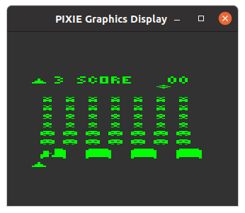
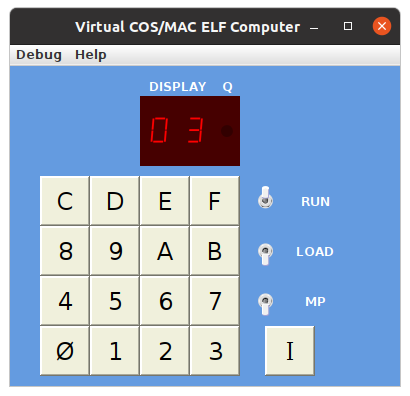

# ELF-II Invaders Game

There is a classic invaders game (no soource code) in binary form
at progs/invaders/invaders.bin. A hex dump of the code is in "Invaders.rom".

This does not play great on the simulator, as trying to use a mouse to
press "0", "3", and "I" is not responsive enough to play the game.
The Elf-II version does support using keyboard shortcuts for the hex keypad,
but "I" must still be pressed using the mouse. But, the fact that it runs
suggests that the simulator is working as expected.




The configuration used was (with CWD in "bin"):
```
ram=64k
preload=../progs/invaders/invaders.bin
pixie
model=elf2
elf2_case
autorun
```

(Note, this code will not run as a PROM)
