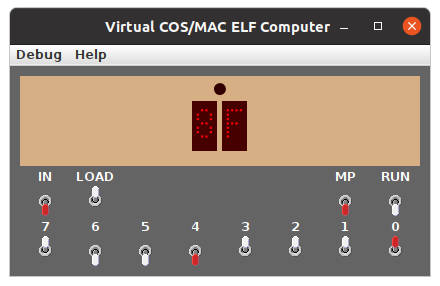
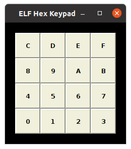

# COS/MAC ELF Simulator

This simulator aspires to replicate the experience of
using the "COS/MAC ELF" home-built computer, as described
in these
.

The default configuration is 256 bytes of RAM and no PROM, no additional hardware.
Optional hardware add-ons include:

* PROM (overlays RAM when jumper installed)
* Hexadecimal Keypad
* PIXIE Graphic Display

A plain-text configuration file may be used to add optional hardware and expand RAM.

The simulator provides a "Help" menu
which contains documentation on configuring and using the simulator.
The simulator is started using this command:

java -jar VirtualCOSMAC_EFL.jar [*config-file*]

Where *config-file* indicates an optional argument being the filename
of a configuration file ("[]" indicates optional, not literal characters).

The "Debug" menu provides methods for debugging and other conveniences.

An original ELF from James Brown
(http://www.cosmacelf.com/gallery/elf-and-microtutors/)

