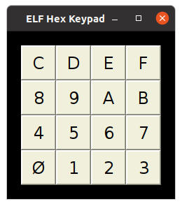

# COS/MAC ELF Simulator

This simulator aspires to replicate the experience of
using the "COS/MAC ELF" home-built computer, as described
in these
[Popular Electronics articles](http://www.exemark.com/Microcontrollers/PopularElecwebc.pdf).

The simulator is contained entirely in the [JAR file](bin/VirtualCOSMAC_ELF.jar).

The default configuration is 256 bytes of RAM and no PROM, no additional hardware.
Optional hardware add-ons include:

* PROM (overlays RAM when jumper installed)
* Hexadecimal Keypad
* [PIXIE Graphic Display](https://htmlpreview.github.io/?https://github.com/durgadas311/cosmac-elf/blob/master/sim/docs/cdp1861.html)
* [RS232 interface connected to Q/EFn pins](https://htmlpreview.github.io/?https://github.com/durgadas311/cosmac-elf/blob/master/sim/docs/quart.html)
* [CDP1854 UART](https://htmlpreview.github.io/?https://github.com/durgadas311/cosmac-elf/blob/master/sim/docs/cdp1854.html)

[Elf-II Running Invaders](INVADERS.md)

A plain-text configuration file may be used to add optional hardware and expand RAM.

The simulator provides a
["Help" menu](https://htmlpreview.github.io/?https://github.com/durgadas311/cosmac-elf/blob/master/sim/docs/cosmac_elf.html)
which contains documentation on configuring and using the simulator.
The simulator is started using this command:

java -jar VirtualCOSMAC_EFL.jar [*config-file*]

Where *config-file* indicates an optional argument being the filename
of a configuration file ("[]" indicates optional, not literal characters).

The "Debug" menu provides methods for debugging and other conveniences.

An original ELF from James Brown
(http://www.cosmacelf.com/gallery/elf-and-microtutors/)

